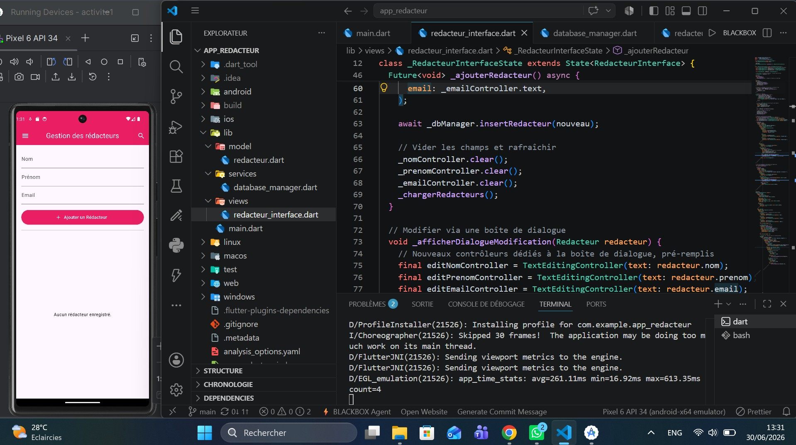
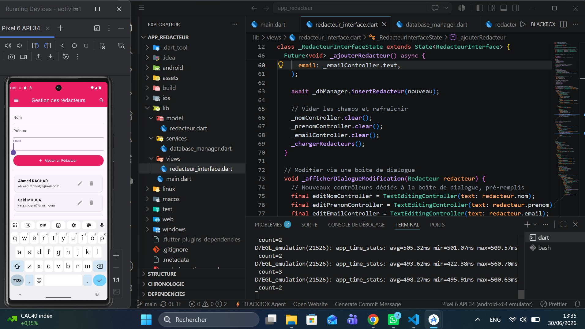
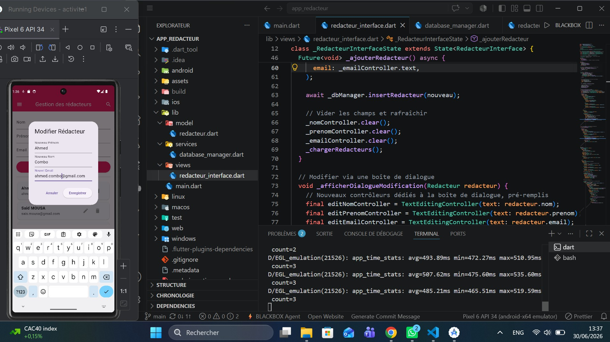
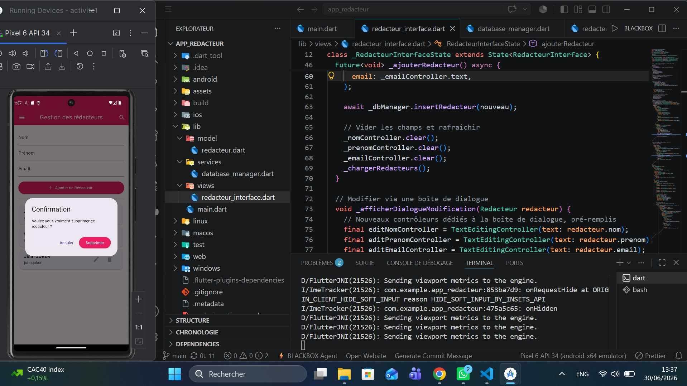

# app_redacteur

# Atelier n°5 : Gestion des données locales avec SqfLite 📱
  
**Objectif :** Créer une application Flutter fonctionnelle pour gérer localement les rédacteurs du « Magazine Infos » à l'aide d'une base de données SQLite via le package `sqflite`.

---

## 📁 1. Organisation des fichiers & Architecture

Conformément aux recommandations de l'atelier, j'ai structuré mon code selon une architecture modulaire propre afin de séparer les responsabilités (UI, logique métier et persistance de données) :

```
lib/
│
├── main.dart                  # Point d'entrée de l'application (MonApplication & MaterialApp)
│
├── modele/
│   └── redacteur.dart         # Modélisation de l'objet Redacteur et conversion Map
│
├── services/
│   └── database_manager.dart  # Gestionnaire SQLite, initialisation et requêtes CRUD
│
└── views/
    └── redacteur_interface.dart # Écran principal Stateful (Formulaire, Listes et Dialogues)
```
---
## 2. Intefaces cles

### homme interface


### add interface


### edit interface


### delete interface


---

## 🛠️ 3. Choix de conception logicielle & Techniques

### Le patron de conception Singleton (Design Pattern)
Pour la classe `DatabaseManager`, j'ai implémenté un **Singleton** via un constructeur privé (`DatabaseManager._init()`). 
* **Pourquoi ce choix ?** Cela garantit qu'une seule instance de la connexion SQLite (`redacteur.db`) reste ouverte à travers toute l'application. Cela évite les ouvertures concurrentes conflictuelles et optimise la mémoire du téléphone.

### Initialisation paresseuse et asynchrone (Lazy Initialization)
La base de données s'initialise à l'aide d'un getter asynchrone (`Future<Database> get database async`). 
* **Pourquoi ce choix ?** L'application n'est pas bloquée au démarrage si le fichier de la base de données met du temps à s'ouvrir. L'initialisation est déclenchée uniquement au premier besoin (premier accès aux données ou écriture).

### Indépendance des couches (Couplage faible)
L'interface graphique `RedacteurInterface` n'exécute aucune requête SQL brute. Elle interagit exclusivement avec l'instance de `DatabaseManager`.
* **Pourquoi ce choix ?** Cette abstraction permet de découpler l'affichage de la technique de stockage. Si l'éditeur du magazine souhaite migrer ses données vers une API cloud à l'avenir, seule la classe service sera modifiée sans impacter mes fichiers de vue.

### Ergonomie par fenêtres contextuelles (`showDialog`)
Suivant scrupuleusement les exigences des parties 6 et 7, les opérations de modification et de suppression s'effectuent par le biais de fenêtres `AlertDialog` :
* **Modification :** Ouvre un dialogue contenant de nouveaux contrôleurs pré-remplis avec les données sélectionnées afin de fluidifier l'expérience.
* **Suppression :** Agit comme une barrière de sécurité pour confirmer l'intention de l'utilisateur avant l'appel à `deleteRedacteur`.

---

## 🚀 4. Fonctionnalités implémentées (Checklist de validation)

Toutes les étapes demandées dans le sujet ont été codées et validées :
- [x] **Modélisation** : Classe `Redacteur` avec attributs (`id` auto-incrémenté optionnel, `nom`, `prenom`, `email`) et sa méthode `toMap()`.
- [x] **Persistance locale** : Création de la table `redacteurs` via `onCreate`.
- [x] **Initialisation** : Chargement automatique des données existantes dès l'ouverture grâce au cycle de vie `initState()`.
- [x] **CRUD Complet** :
  - **Create** : Formulaire supérieur relié à des `TextEditingController` avec nettoyage automatique des champs.
  - **Read** : Rendu dynamique au sein d'un `ListView.builder` rafraîchi par `setState`.
  - **Update** : Édition en place dans une boîte de dialogue avec conservation de l'identifiant unique.
  - **Delete** : Suppression après popup de confirmation.

---

## 💻 5. Dépendances utilisées (`pubspec.yaml`)

```yaml
dependencies:
  flutter:
    sdk: flutter
  sqflite: ^2.3.0  # Gestion SQL native locale
  path: ^1.9.0     # Gestion des chemins système de fichiers
```
